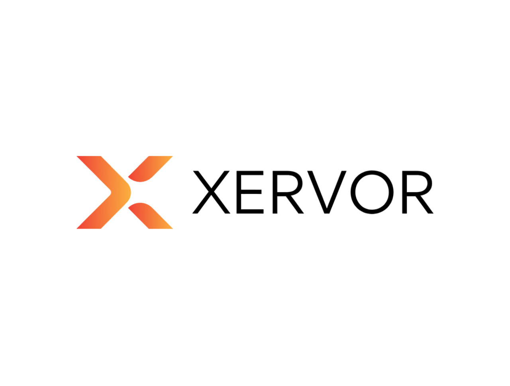

# XERVOR Jellyfin Theme

A modern, gradient-rich theme for Jellyfin inspired by the **XERVOR** brand identity. Includes a custom loading screen, glassy UI, and stylish CSS tweaks.

---

## ✨ Features

- 🔥 Gradient header, buttons & scrollbars (`#ff4e00 → #f9d423`)
- 🧊 Glassmorphism-style cards with subtle hover effects
- 🎬 Custom loading screen with XERVOR logo
- 🌓 Dark theme with high contrast for easy viewing
- 📱 Fully responsive and lightweight

---

## 📂 Installation

### Option A: Using [Custom CSS Plugin](https://jellyfin.org/docs/general/custom-css)

1. Extract this repo or download [XervorTheme.zip](https://github.com/yourusername/XervorTheme/releases).
2. Upload `css/theme.css` to your Jellyfin server (e.g. `/config/theme/`).
3. Go to **Dashboard → Plugins → Custom CSS** and enter:
